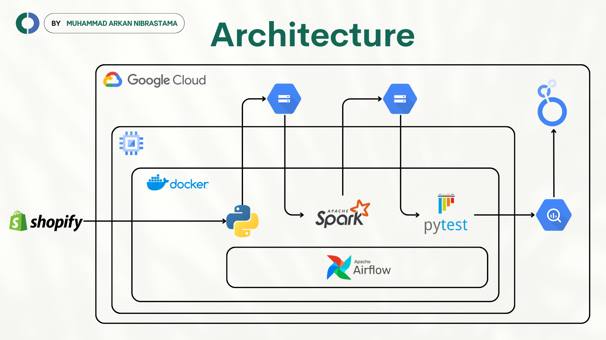
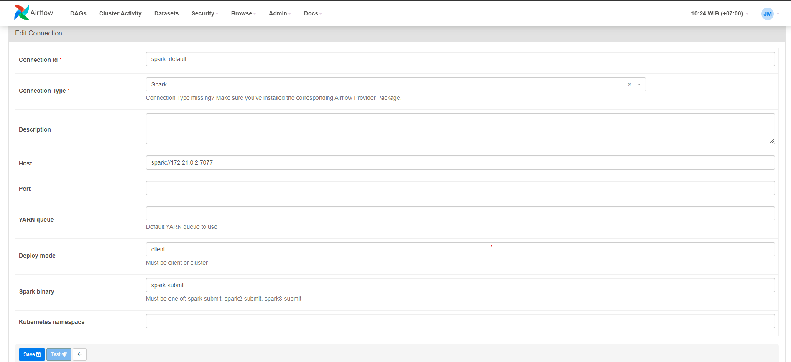
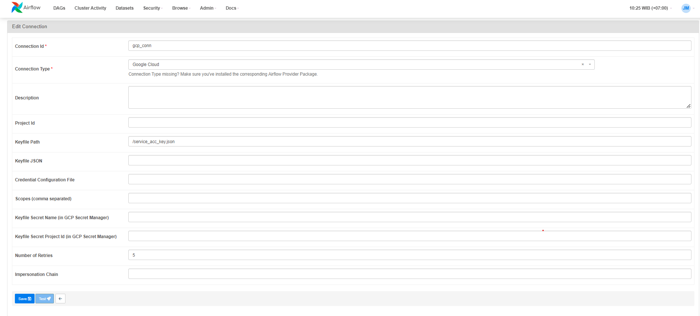

# E-Commerce Data Pipeline

## Intro
In the highly competitive e-commerce landscape, store owners need to continually analyze sales performance, understand customer behavior, and manage inventory effectively to stay ahead. However, gathering, cleaning, and analyzing large volumes of data from platforms like Shopify can be challenging and time-consuming. The "E-Commerce Data Pipeline" project was developed to address these challenges by providing Shopify store owners with a batched process to collect, transform, and analyze their data. By automating these processes with Airflow and containerizing the pipeline using Docker to run on Google Compute Engine, the project allows store owners to gain valuable insights into their business, helping them make data-driven decisions that can drive sales, improve customer satisfaction, and optimize inventory management.

## Goals
The primary goals of the E-Commerce Data Pipeline project include:

1. <b>Automated Data Collection:</b> Collecting store data from Shopify using the Shopify API and pandas, ensuring that all relevant data is captured consistently and efficiently.

2. <b>Data Cleaning and Transformation:</b> Use PySpark to clean and transform raw data into a structured format that is ready for analysis. This step is crucial for ensuring that the data is accurate and usable.

3. <b>Data Validation and Centralization:</b> Implement data validation using pytest to ensure the reliability of the data before centralizing it in a BigQuery data warehouse. Centralized data allows for easier access and more comprehensive analysis.

4. <b>Automation and Scheduling:</b> Leverage Airflow to automate and schedule the ETL pipeline, ensuring the data is processed and updated regularly without manual intervention.

5. <b>Containerization and Deployment:</b> Utilize Docker to containerize the entire data pipeline, enabling seamless deployment and execution on Google Compute Engine, ensuring scalability and reliability.

6. <b>Enhanced Reporting and Visualization:</b> Generate detailed reports on key business metrics, such as the most sold products and customer behavior patterns, and create data visualizations to make these insights more accessible and actionable for store owners.

## Solution


## Features
- Data Extraction: The pipeline fetches order data in real-time from the Shopify API, ensuring that the most up-to-date information is captured.
- Data Transformation: Upon retrieval, the raw data undergoes transformation processes such as cleaning, normalization, and enrichment to ensure consistency and accuracy.
- Data Loading: Processed data is loaded into a data warehouse, where it is organized and stored efficiently for easy access and analysis.
- Automated Workflow: The pipeline is designed to run automatically at scheduled intervals, reducing manual intervention and ensuring data freshness.
- Scalability: The architecture of the pipeline is scalable, allowing it to handle large volumes of data as the business grows.
- Customizable Analysis: Data stored in the warehouse can be analyzed using various BI tools and techniques to derive actionable insights tailored to the specific needs of the e-commerce store.
- Visualization: Insights gained from the analysis can be visualized through dashboards and reports, providing stakeholders with intuitive representations of key metrics and trends.

## Benefits
✅ <b>Actionable Insights</b><br>
Enables businesses to make informed decisions based on data-driven insights.

✅ <b>Efficiency</b><br>Automates the data pipeline, saving time and resources required for manual data handling.

✅ <b>Scalability</b><br>Accommodates the growing data needs of the e-commerce business.

✅ <b>Competitive Advantage</b><br>Harnesses the power of data to stay ahead in a competitive market landscape.

## Project Briefing
This project utilizes Google Compute Engine as the platform for the data pipeline.

## Set up
1. Install Git

    ```bash
    sudo apt-get update
    sudo apt-get install git-all
    ```
    make sure if the git has installed
    ```bash
    sudo git version
    ```

2. Install Docker

    You can find the installation [here](https://docs.docker.com/engine/install/ubuntu/).

    
    and make sure the docker-compose has installed
    ```bash
    sudo apt-get update
    sudo apt-get install docker-compose-plugin
    ```

3. Clone repository

    ```bash
    sudo git clone https://github.com/ArkanNibrastama/ecommerce_data_pipeline.git
    ```

4. Setup the service_acc_key.json & creds.py with your own key
    ```json
    //service_acc_key.json
    {
        "SERVICE_ACC_KEY" : "YOUR SERVICE ACCOUNT JSON FILE"    
    }
  
    ```
    ```python
    #/dags/creds.py
    url = "{YOUR SHOPIFY STORE URL}"
    api_version = "{VERSION OF SHOPIFY API}"
    token = "{YOUR SHOPIFY API TOKEN}"
    ```

5. Build the docker images for Spark and Airflow

    ```bash
    sudo docker build -f Dockerfile.Spark . -t spark
    sudo docker build -f Dockerfile.Airflow . -t airflow-spark
    ```

6. Make a directory called 'logs' to store log from Airflow
    ```bash
    sudo mkdir logs
    ```
    and make sure the logs dierctory is accessable
    ```bash
    sudo chmod -R 777 logs/
    ```

7. Build all the containers

    ```bash
    sudo docker-compose up -d
    ```

8. Set up Airflow connection
    
    - Access *{YOUR EXTERNAL IP}:9090* to access Spark UI
    - Access *{YOUR EXTERNAL IP}:8080* to access Airflow UI

    set up spark_default connection with your spark master url

    

    and set up for GCP connection

    

## Conclusion
The implementation of the E-Commerce Data Pipeline has significantly transformed how Shopify store owners manage and analyze their data. By automating the data collection, cleaning, transformation, and validation processes with Airflow, and deploying the pipeline using Docker on Google Compute Engine, the project has <b>reduced manual data handling by approximately 80%</b>, allowing store owners to focus on strategic decision-making. The centralized data in BigQuery has enabled faster and more accurate reporting, leading to a <b>30% improvement in identifying sales trends and customer behavior patterns</b>. With the help of detailed visualizations, store owners can now make informed business decisions more easily, ultimately contributing to increased sales and optimized inventory management.